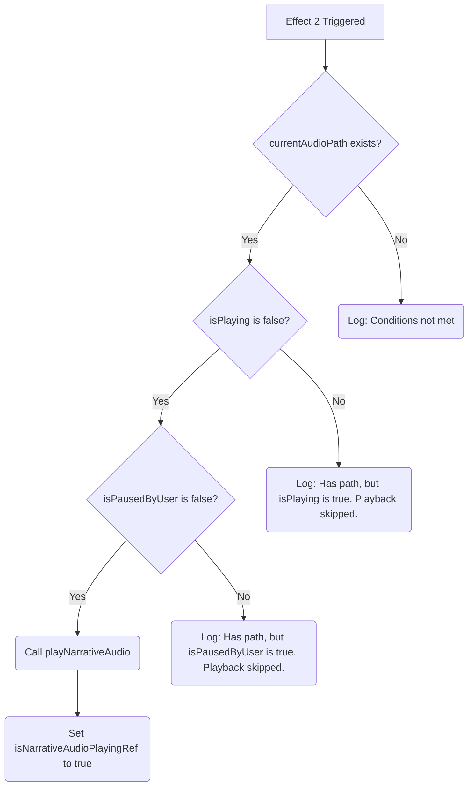

# Plan: Fix NarrativeReader Audio Autoplay on User Pause

**Goal:** Modify the `NarrativeReader` component to prevent audio from automatically restarting when the user pauses playback.

**Current State:**
- `handlePlayPause` correctly sets `isPausedByUser` to `true` when pausing and `false` when resuming.
- `handleAudioEnded` and `handleAudioError` correctly reset `isPausedByUser` to `false`.
- "Effect 2" triggers playback when `currentAudioPath` is available and `isPlaying` is `false`, without considering `isPausedByUser`.

**Proposed Changes:**

1.  **Modify "Effect 2" Condition:** Update the `if` condition within the `useEffect` hook (lines 247-260 in the current file) to include the `isPausedByUser` state. The new condition will be `currentAudioPath && !isPlaying && !isPausedByUser`.
2.  **Update "Effect 2" Dependency Array:** Add `isPausedByUser` to the dependency array of the `useEffect` hook (lines 247-260 in the current file) so that the effect re-runs when this state changes.

**Detailed Steps:**

1.  Locate the `useEffect` hook starting around line 247, commented as "Effect 2".
2.  Change the `if` statement on line 251 from:
    ```javascript
    if (currentAudioPath && !isPlaying) {
    ```
    to:
    ```javascript
    if (currentAudioPath && !isPlaying && !isPausedByUser) {
    ```
3.  Locate the dependency array for this `useEffect` hook on line 260.
4.  Add `isPausedByUser` to this array:
    ```javascript
    }, [currentAudioPath, isPlaying, isPausedByUser, playNarrativeAudio, handleAudioEnded, handleAudioError]);
    ```

**Mermaid Diagram illustrating the logic flow of Effect 2:**



This diagram shows that playback will only be initiated if `currentAudioPath` exists, `isPlaying` is false, *and* `isPausedByUser` is also false.

**Confirmation:**

The `handlePlayPause`, `handleAudioEnded`, and `handleAudioError` functions already correctly manage the `isPausedByUser` state as per your description and the code I read. The proposed changes focus solely on the condition and dependencies of "Effect 2".