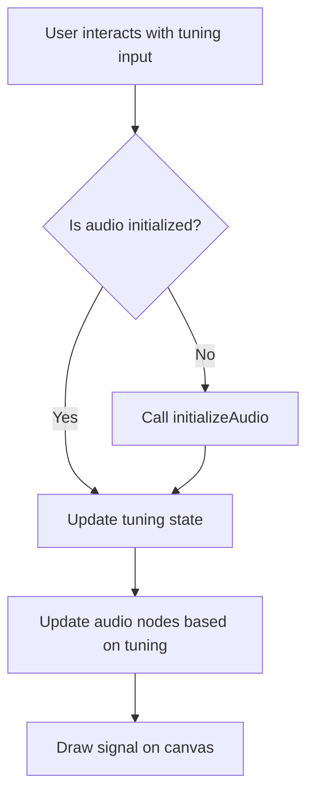

# Plan for Phase 3, Step 4 (Audio - Web Audio API) - Continued: Address AudioContext Autoplay Warning

This plan outlines the steps to modify `src/components/SignalTuningInterface.jsx` to initialize the AudioContext only upon the first user interaction with the tuning controls, thereby addressing the autoplay warning.

**Steps:**

1.  **Modify `useSignalAudio` hook usage:** Update the component to access `initializeAudio` and `isAudioInitialized` from the `useSignalAudio` hook.
2.  **Add conditional audio initialization:** In the `onChange` handlers for both the frequency and amplitude range inputs, add a check to see if `isAudioInitialized` is false. If it is, call the `initializeAudio` function. This will ensure the AudioContext is only initialized upon the first user interaction with the tuning controls.

**Logic Flow for User Interaction with Tuning Inputs:**

**Verification:**

Once these changes are implemented:

3.  I will inform you that the changes have been made to address the AudioContext autoplay warning.
4.  I will ask you to check the application in the browser to confirm that the warning is no longer present and that the audio functionality works as expected.