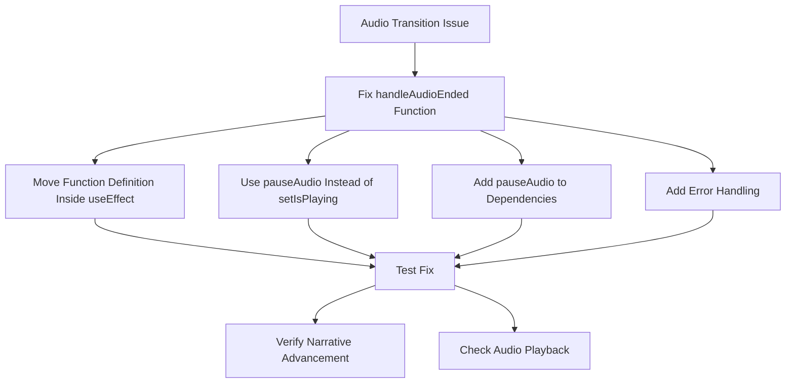

# Audio Transition Fix Plan

## Problem Analysis

The issue occurs in the `NarrativeReader` component where the `handleAudioEnded` function is trying to call `setIsPlaying(false)` but this function is not accessible within the scope where `handleAudioEnded` is being executed. This is causing a ReferenceError that prevents the rest of the function from executing, including the logic to advance to the next narrative node.

From the console logs, we can see the exact error:
```
Uncaught ReferenceError: setIsPlaying is not defined at HTMLAudioElement.handleAudioEnded (index.jsx:398:11)
```

## Root Cause

The root cause is a closure issue within React's useEffect hook. The `handleAudioEnded` function is defined inside the useEffect but doesn't have access to the current `setIsPlaying` function from the `useAudio` hook. This is a common issue with event listeners and closures in React.

## Solution Plan



### Implementation Plan

1. **Modify the handleAudioEnded function in NarrativeReader/index.jsx**:
   - Define the function inside the useEffect to ensure it has access to current values
   - Use the `pauseAudio` function from the `useAudio` hook instead of directly trying to set isPlaying
   - Add `pauseAudio` to the dependency array of the useEffect
   - Add try/catch blocks and enhanced logging for better error handling

Here's the specific code change needed:

```javascript
// Effect to handle narrative completion based on audio 'ended' event
useEffect(() => {
    const audioInstance = getAudioInstance();
    let isMounted = true; // Flag to prevent state updates on unmounted component

    // Define the handler INSIDE the effect to ensure it has access to current functions
    const handleAudioEnded = () => {
        try {
            if (isMounted) {
                console.log('[NarrativeReader] Audio "ended" event triggered. Resetting state.');
                
                // CRITICAL FIX: Use pauseAudio instead of setIsPlaying
                pauseAudio(); // This will set isPlaying to false internally
                setIsPausedByUser(false); // Also reset pause state
        
                // Set the pending flag to true immediately
                narrativeAdvancementPendingRef.current = true;
        
                // Get the latest state using get() from Zustand
                const state = useGameStore.getState();
                const currentGameState = state.gameState;
                console.log(`[NarrativeReader] Current game state node: ${currentGameState.currentNodeId}`);
        
                // Determine the next node ID based on the 'next' property in the narrative data
                const nextNodeId = narrativeData?.next;
                console.log(`[NarrativeReader] Next node from narrative data: ${nextNodeId}`);
        
                if (!nextNodeId) {
                    console.warn(`[NarrativeReader] Narrative node ${currentGameState.currentNodeId} has no 'next' property. Narrative ends here.`);
                    // Optionally handle narrative ending (e.g., show credits, return to main menu)
                    narrativeAdvancementPendingRef.current = false; // Reset flag if narrative ends
                    return; // Stop narrative progression
                }
        
                console.log(`[NarrativeReader] Advancing to next node: ${nextNodeId}`);
        
                // Update currentNodeId in Zustand
                updateGameState({ currentNodeId: nextNodeId });
                console.log(`[NarrativeReader] Game state updated with new node: ${nextNodeId}`);
        
                // Reset the pending flag after a short delay to allow state update to propagate
                setTimeout(() => {
                    narrativeAdvancementPendingRef.current = false;
                    console.log('[NarrativeReader] Narrative advancement completed.');
                }, 500); // Adjust delay as needed
            }
        } catch (error) {
            console.error('[NarrativeReader] Error in handleAudioEnded:', error);
            // Attempt to recover by resetting flags
            narrativeAdvancementPendingRef.current = false;
            
            // Try to pause audio anyway in case of error
            try {
                pauseAudio();
            } catch (pauseError) {
                console.error('[NarrativeReader] Error while trying to pause audio during error recovery:', pauseError);
            }
        }
    };

    if (audioInstance && typeof audioInstance.addEventListener === 'function') {
        console.log('[NarrativeReader] Adding "ended" event listener.');
        audioInstance.addEventListener('ended', handleAudioEnded);

        return () => {
            console.log('[NarrativeReader] Removing "ended" event listener.');
            isMounted = false;
            audioInstance.removeEventListener('ended', handleAudioEnded);
        };
    } else if (audioInstance && typeof audioInstance.on === 'function') {
        // Handle cases where it might use .on/.off (like Howler v2)
        console.log('[NarrativeReader] Adding "end" event listener (Howler style).');
        audioInstance.on('end', handleAudioEnded); // Howler.js uses 'end' event

        return () => {
            console.log('[NarrativeReader] Removing "end" event listener (Howler style).');
            isMounted = false;
            audioInstance.off('end', handleAudioEnded);
        };
    } else if (audioInstance) {
        console.warn('[NarrativeReader] Audio instance does not support standard event listeners (addEventListener/on). Cannot track "ended" event for narrative completion.');
        
        // Since we can't use event listeners, set up a polling mechanism to check audio position
        console.log('[NarrativeReader] Setting up polling mechanism to check audio position.');
        const checkInterval = 1000; // Check every second
        const intervalId = setInterval(() => {
            if (!audioInstance) return;
            
            const currentTime = audioInstance.currentTime || 0;
            const duration = audioInstance.duration || 0;
            
            // If we're near the end of the audio (within 0.5 seconds)
            if (duration > 0 && currentTime > 0 && (duration - currentTime) < 0.5) {
                console.log('[NarrativeReader] Detected end of audio via polling.');
                handleAudioEnded();
                clearInterval(intervalId);
            }
        }, checkInterval);
        
        return () => {
            console.log('[NarrativeReader] Clearing audio position polling interval.');
            clearInterval(intervalId);
            isMounted = false;
        };
    }

    // Cleanup if audioInstance is null
    return () => {
        console.log('[NarrativeReader] Cleanup with no audio instance.');
        isMounted = false;
    };

}, [getAudioInstance, narrativeData, updateGameState, pauseAudio]); // Add pauseAudio to dependencies
```

### Testing Plan

1. Test the audio playback sequence from flashback_intro to Chapter1_LunarArrival
2. Verify that the `handleAudioEnded` function executes without errors
3. Confirm that the narrative advances to the next node automatically
4. Check that the audio plays correctly for both tracks
5. Monitor the console logs for the enhanced logging messages

## Additional Considerations

1. The narrative flow is correctly set up in the JSON files:
   - flashback_intro.json has "next": "Chapter1_LunarArrival"
   - Chapter1_LunarArrival.json has "next": "Chapter1_LunarSignalAnalysisIntro"

2. The gain node fix is already implemented based on the logs showing `[AudioContext] Master gain node reset to 1 before playing new track`

3. The existing polling mechanism serves as a fallback for cases where the ended event doesn't fire properly