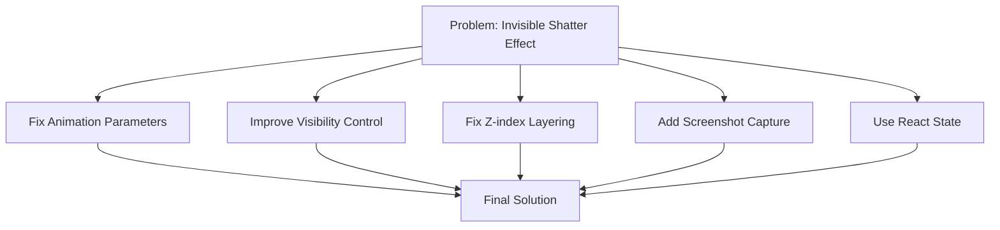

# Final Plan: Fix Glass Shattering Transition Effect

## Problem Analysis

Based on our testing and the user's feedback, we've identified several issues with the glass shattering transition effect:

1. **Animation Visibility Issues**: The shards might be animating too quickly or flying off-screen immediately
2. **Initial Visibility Issues**: Timing problems between animation phases
3. **Z-index Conflicts**: Overlapping elements with different z-indices
4. **DOM Manipulation Issues**: Direct DOM manipulation instead of React's declarative approach

## Solution Approach

We'll implement a more effective solution that addresses these issues while maintaining the visual impact of the effect.



## Detailed Implementation Plan

### 1. Modify Animation Parameters

The current animation parameters cause the shards to move too quickly and too far:

```javascript
tl.to(el, {
  y: `+=${200 + Math.random() * 400}`, // Very large values
  x: `${xDirection > 0 ? '+' : '-'}=${50 + Math.random() * 150}`,
  rotation: Math.random() * 720 - 360, // Extreme rotation
  opacity: 0,
  scale: Math.random() * 0.5 + 0.5,
  duration: SHATTER_ANIMATION_DURATION / 1000,
  ease: "power3.in",
  delay: delay
}, 0);
```

**Changes needed:**
- Increase `SHATTER_ANIMATION_DURATION` to at least 4000ms
- Add an initial delay of 200ms before animation starts
- Reduce movement values for more controlled effect:
  - `y: +=${100 + Math.random() * 200}`
  - `x: ${xDirection > 0 ? '+' : '-'}=${30 + Math.random() * 70}`
  - `rotation: Math.random() * 360 - 180`
- Use a slower easing function like "power2.inOut"

### 2. Add Screenshot Capture Step

Before creating shards, take a "screenshot" of the current view to ensure we have an accurate representation of what should be shattered:

```javascript
// Before creating shards, capture the current view
if (textContainerRef.current && shardsContainerRef.current) {
  const textBounds = textContainerRef.current.getBoundingClientRect();
  
  // Create an image element to hold the captured content
  const captureImg = document.createElement('img');
  captureImg.style.position = 'absolute';
  captureImg.style.width = '100%';
  captureImg.style.height = '100%';
  captureImg.style.objectFit = 'cover';
  captureImg.style.zIndex = '1999';
  
  // Use html2canvas or a similar approach to capture the content
  html2canvas(textContainerRef.current).then(canvas => {
    captureImg.src = canvas.toDataURL();
    shardsContainerRef.current.appendChild(captureImg);
    
    // After a short delay, hide the image and show the shards
    setTimeout(() => {
      captureImg.style.display = 'none';
      // Create and animate shards here
    }, 100);
  });
}
```

### 3. Ensure Proper Z-index Layering

Establish a clear z-index hierarchy:

- Text container: z-index 1000
- Shards container: z-index 2000
- Individual shards: Don't set explicit z-index to avoid conflicts
- Debug overlay: z-index 3000

### 4. Improve Visibility Control

Add explicit visibility controls with proper timing:

```javascript
// In the shattering phase effect
if (animationPhase === 'shattering') {
  // Add a delay before starting the animation for better visibility
  setTimeout(() => {
    // Hide text container with a fade out effect
    if (textContainerRef.current) {
      textContainerRef.current.style.transition = 'opacity 0.3s ease-out';
      textContainerRef.current.style.opacity = '0';
      
      // After fade out, hide completely
      setTimeout(() => {
        textContainerRef.current.style.visibility = 'hidden';
      }, 300);
    }
    
    // Show shards container with explicit styles
    if (shardsContainerRef.current) {
      shardsContainerRef.current.style.visibility = 'visible';
      shardsContainerRef.current.style.opacity = '1';
    }
    
    // Create and animate shards
    const shards = createShards();
    animateShards(shards);
  }, 500); // Delay before starting animation
}
```

### 5. Use React State for Shard Management

Instead of direct DOM manipulation, use React's state management:

```javascript
// Add state for shards
const [shards, setShards] = useState([]);

// Create shards function that updates state
const createShards = () => {
  const newShards = [];
  // Generate shard data
  for (let x = 0; x < GRID_SIZE; x++) {
    for (let y = 0; y < GRID_SIZE; y++) {
      // Calculate shard properties
      newShards.push({
        id: `shard-${x}-${y}`,
        style: {
          position: 'absolute',
          left: `${x * cellWidth}px`,
          top: `${y * cellHeight}px`,
          width: `${cellWidth}px`,
          height: `${cellHeight}px`,
          backgroundColor: `hsla(${(x * 60 + y * 30) % 360}, 100%, 50%, 0.8)`,
          border: '2px solid white',
          display: 'flex',
          justifyContent: 'center',
          alignItems: 'center',
          fontSize: '14px',
          fontWeight: 'bold',
          color: 'white'
        },
        text: `${x},${y}`
      });
    }
  }
  setShards(newShards);
  return newShards;
};

// In the render function
{animationPhase === 'shattering' && shards.map((shard) => (
  <div 
    key={shard.id}
    className={styles.shard}
    style={shard.style}
  >
    {shard.text}
  </div>
))}
```

### 6. Add Enhanced Debugging

Add more detailed debugging to track the transition process:

```javascript
// Add a debug counter for visible shards
const [visibleShardCount, setVisibleShardCount] = useState(0);

// Update the debug overlay
<div style={{
  position: 'absolute',
  bottom: '10px',
  left: '10px',
  backgroundColor: 'rgba(0, 0, 0, 0.8)',
  color: '#00ff00',
  padding: '10px',
  fontSize: '16px',
  fontWeight: 'bold',
  zIndex: 3000,
  border: '2px solid #00ff00'
}}>
  Phase: {animationPhase}<br/>
  Shards: {visibleShardCount}<br/>
  Container: {containerRef.current ? `${containerRef.current.clientWidth}x${containerRef.current.clientHeight}` : 'null'}
</div>
```

### 7. Add Fallback Mechanism

Ensure the transition completes even if the animation fails:

```javascript
// Set a timeout to ensure we don't get stuck if animation fails
const fallbackTimer = setTimeout(() => {
  console.log('[IntroTransition] Fallback timer triggered - animation may have failed');
  // Complete the transition
  setAnimationPhase('done');
  if (onComplete) {
    onComplete();
  }
}, SHATTER_ANIMATION_DURATION + 2000); // Animation duration plus buffer

// Clear the fallback timer if animation completes normally
tl.eventCallback('onComplete', () => {
  clearTimeout(fallbackTimer);
  // Rest of onComplete logic...
});
```

## Implementation Sequence

1. Update animation parameters and timing
2. Implement proper z-index layering
3. Add screenshot capture step
4. Improve visibility control with proper transitions
5. Convert to React state-based approach
6. Add enhanced debugging
7. Implement fallback mechanism

## Testing Plan

1. Test with different browsers to ensure compatibility
2. Add console logs at key points to track execution
3. Use browser developer tools to inspect the DOM during transition
4. Test with different screen sizes to ensure responsiveness

## Expected Result

A visually striking glass shattering transition effect where:
1. Text is clearly visible before the transition
2. Shards appear and animate outward from the center
3. Animation is slow enough to be visible but fast enough to be dramatic
4. Transition completes reliably even if animation fails