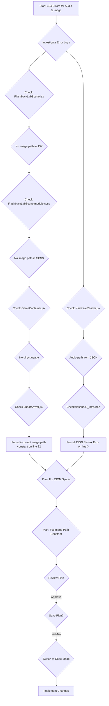

# Plan: Fix Asset Path Errors

This plan addresses the 404 errors encountered for an audio file and an image file by correcting their paths in the relevant project files.

## Problem Identification

- **Audio Error:** Console logs show `GET http://localhost:5173/placeholder_audio.mp3 404 (Not Found)`. Investigation revealed this was caused by a JSON syntax error in `public/narratives/flashback_intro.json` preventing the correct path (`/audio/narration/flashback.mp3`) from being parsed.
- **Image Error:** Console logs show `GET http://localhost:5173/images/lab_background.png 404 (Not Found)`. Investigation traced this to an incorrect path defined in a constant within `src/scenes/LunarArrival/index.jsx`. The correct path is `/front_pic/lab.png`.

## Plan Steps

1.  **Fix JSON Syntax:** Correct the syntax error in `public/narratives/flashback_intro.json` by adding the missing closing quote and comma to line 3.
    *   **File:** `public/narratives/flashback_intro.json`
    *   **Change:** Modify line 3 from `"audio": "/audio/narration/flashback.mp3` to `"audio": "/audio/narration/flashback.mp3",`
    *   **Tool:** `write_to_file` (providing full corrected content).
2.  **Fix Image Path:** Update the `labBackgroundImage` constant definition in `src/scenes/LunarArrival/index.jsx`.
    *   **File:** `src/scenes/LunarArrival/index.jsx`
    *   **Change:** Modify line 22 from `const labBackgroundImage = '/images/lab_background.png';` to `const labBackgroundImage = '/front_pic/lab.png';`
    *   **Tool:** `apply_diff`.

## Investigation Flow

## Next Steps

- Implement the changes using the specified tools in Code mode.
- Verify the fixes by running the application and checking the browser console for the previous 404 errors.