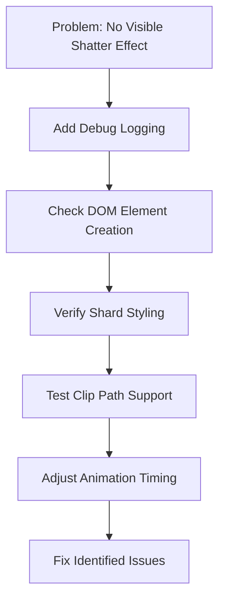
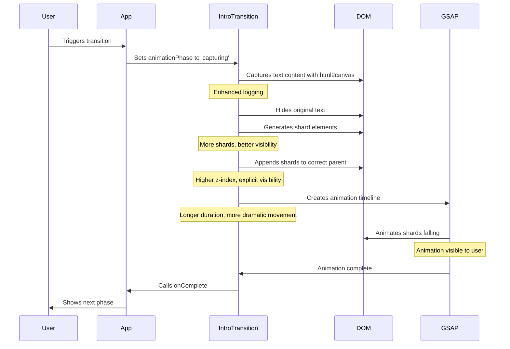

# Plan: Fix Broken Glass Transition Effects

Based on the information gathered, I've created a detailed plan to fix the broken glass transition effects. The logs show that the code is executing through all the expected phases, but the visual effect isn't appearing.

## Problem Analysis

From the logs provided, we can see:
1. The transition is being triggered
2. Content is being captured and drawn to canvas
3. Shatter animation is starting and completing
4. The transition is moving to the next phase

However, no visual shatter effect is visible to the user. The screen transitions directly from showing the text to the flashbackNarrative phase.

## Potential Issues

1. **DOM Element Creation and Appending**: The shards might not be correctly appended to the DOM
2. **Visibility Issues**: The shards might be created but not visible due to z-index, opacity, or other CSS properties
3. **Clip Path Problems**: Issues with the clip-path implementation or browser support
4. **Animation Timing**: Animation might be too quick or shards removed too soon
5. **Shard Generation Logic**: Might not be creating enough shards or creating shards that are too small
6. **Parent Container Issues**: The container might have styles affecting shard visibility

## Diagnostic Steps



## Implementation Plan

### 1. Add Enhanced Debug Logging

Add more detailed logging to track exactly what's happening during the transition:

```javascript
// In the capturing phase
console.log('[IntroTransition] Canvas dimensions:', canvasRef.current.width, 'x', canvasRef.current.height);
console.log('[IntroTransition] Text elements visibility before capture:', textElementsRef.current.style.visibility);

// After generating shards
console.log('[IntroTransition] Generated shards count:', shards.length);
console.log('[IntroTransition] First shard vertices:', shards[0]?.vertices);

// After creating DOM elements
console.log('[IntroTransition] Created shard elements count:', shardElements.length);
console.log('[IntroTransition] Container reference valid:', !!containerRef.current);

// During animation
console.log('[IntroTransition] Animation starting with duration:', SHATTER_ANIMATION_DURATION / 1000);
```

### 2. Fix DOM Element Creation and Appending

Modify how shard elements are appended to ensure they're added to the correct parent:

```javascript
// Create a document fragment for better performance
const fragment = document.createDocumentFragment();
const shardElements = [];

// ... create shard elements ...

// Add all shards to the DOM at once - use the parent div with z-index 1500
const parentElement = containerRef.current.closest('div[style*="z-index: 1500"]') || containerRef.current;
parentElement.appendChild(fragment);
```

### 3. Ensure Shard Visibility

Update the shard styling to guarantee visibility:

```javascript
// Position and style the shard
shardEl.style.position = 'absolute';
shardEl.style.left = '0';
shardEl.style.top = '0';
shardEl.style.width = `${width}px`;
shardEl.style.height = `${height}px`;
shardEl.style.backgroundImage = `url(${capturedImageUrl})`;
shardEl.style.clipPath = clipPath;
shardEl.style.webkitClipPath = clipPath;
shardEl.style.zIndex = '2000'; // Increase z-index to ensure visibility
shardEl.style.opacity = '1'; // Explicitly set opacity
shardEl.style.visibility = 'visible'; // Explicitly set visibility
shardEl.style.pointerEvents = 'none'; // Allow clicks to pass through
```

### 4. Test and Fix Clip Path Support

Add a fallback for browsers with limited clip-path support:

```javascript
// Test if clip-path is supported
const testEl = document.createElement('div');
testEl.style.clipPath = 'polygon(0 0, 0 0, 0 0)';
const clipPathSupported = !!testEl.style.clipPath;

console.log('[IntroTransition] Clip path supported:', clipPathSupported);

// If clip-path isn't supported, use a simpler approach with rectangular shards
if (!clipPathSupported) {
  // Create a grid of rectangular shards instead
  const gridSize = 8; // 8x8 grid
  const cellWidth = width / gridSize;
  const cellHeight = height / gridSize;
  
  for (let x = 0; x < gridSize; x++) {
    for (let y = 0; y < gridSize; y++) {
      const shardEl = document.createElement('div');
      shardEl.className = styles.shard;
      
      shardEl.style.position = 'absolute';
      shardEl.style.left = `${x * cellWidth}px`;
      shardEl.style.top = `${y * cellHeight}px`;
      shardEl.style.width = `${cellWidth}px`;
      shardEl.style.height = `${cellHeight}px`;
      shardEl.style.backgroundImage = `url(${capturedImageUrl})`;
      shardEl.style.backgroundPosition = `-${x * cellWidth}px -${y * cellHeight}px`;
      shardEl.style.zIndex = '2000';
      
      fragment.appendChild(shardEl);
      shardElements.push(shardEl);
    }
  }
}
```

### 5. Adjust Animation Timing

Modify the animation timing to ensure it's visible:

```javascript
// Increase animation duration and add delay before starting
const SHATTER_ANIMATION_DURATION = 5000; // 5 seconds (increased from 3)
const ANIMATION_START_DELAY = 500; // 0.5 second delay before animation starts

// Add a delay before starting the animation
setTimeout(() => {
  // Add animations for each shard
  shardElements.forEach((el, index) => {
    const shard = shards[index];
    const delay = index * 0.02; // Increased stagger delay
    
    tl.to(el, {
      y: `+=${200 + Math.random() * 600}`, // More dramatic fall
      x: `${(shard.center[0] < width/2) ? '-' : '+'}=${50 + Math.random() * 150}`, // More movement
      rotation: Math.random() * 360 - 180, // Full rotation range
      opacity: 0,
      duration: SHATTER_ANIMATION_DURATION / 1000, // Convert to seconds
      ease: "power2.in", // Stronger easing
      delay: delay
    }, 0);
  });
}, ANIMATION_START_DELAY);
```

### 6. Improve Shard Generation

Enhance the shard generation to create more visible shards:

```javascript
// Function to generate random points for shard shapes
const generateShardPoints = (width, height, numPoints = 40) => { // Increased point count
  const points = [];
  // Create more points along the edges to ensure coverage
  // Top and bottom edges
  for (let i = 0; i < width; i += width / 10) { // More edge points
    points.push([i, 0]);
    points.push([i, height]);
  }
  // Left and right edges
  for (let i = 0; i < height; i += height / 10) { // More edge points
    points.push([0, i]);
    points.push([width, i]);
  }
  
  // Add random internal points
  for (let i = 0; i < numPoints; i++) {
    points.push([
      Math.random() * width,
      Math.random() * height
    ]);
  }
  return points;
};
```

### 7. Add Visual Debugging

Add visual indicators to help debug the issue:

```javascript
// Add a visible border to the container for debugging
if (containerRef.current) {
  containerRef.current.style.border = '2px solid red';
}

// Add a colored background to each shard for visibility
shardEl.style.backgroundColor = `rgba(${Math.random() * 255}, ${Math.random() * 255}, ${Math.random() * 255}, 0.7)`;
```

### 8. Implement Fallback Mechanism

Add a fallback mechanism in case the shatter effect still doesn't work:

```javascript
// Set a timeout to ensure we don't get stuck if animation fails
const fallbackTimer = setTimeout(() => {
  console.log('[IntroTransition] Fallback timer triggered - animation may have failed');
  // Clean up any shard elements that might exist
  shardElements.forEach(el => {
    if (el.parentNode) {
      el.parentNode.removeChild(el);
    }
  });
  // Complete the transition
  setAnimationPhase('done');
  if (onComplete) {
    onComplete();
  }
}, SHATTER_ANIMATION_DURATION + 2000); // Animation duration plus buffer

// Clear the fallback timer if animation completes normally
tl.eventCallback('onComplete', () => {
  clearTimeout(fallbackTimer);
  // Rest of onComplete logic...
});
```

## Testing Plan

1. Add console logs at key points to track execution
2. Use browser developer tools to inspect the DOM during transition
3. Test with different browsers to check for compatibility issues
4. Add temporary visual debugging elements to verify positioning

## Flow Diagram



## Implementation Considerations

1. **Browser Compatibility**: Ensure the solution works across different browsers
2. **Performance**: Monitor performance during the animation, especially with increased shard count
3. **Fallback Mechanism**: Implement a reliable fallback in case the animation fails
4. **Visual Quality**: Balance between performance and visual quality