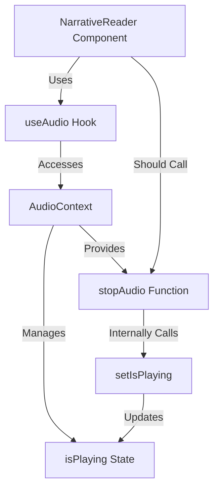

# Fix for NarrativeReader useCallback Dependencies Issue

## Problem Analysis

After examining the code, I've identified the root cause of the error:

```
Uncaught ReferenceError: setIsPlaying is not defined
    at NarrativeReader (index.jsx:236:39)
```

The issue is that the NarrativeReader component is trying to use `setIsPlaying` in both:
1. The body of the `handleAudioEnded` callback (line 218)
2. The dependency array of the useCallback hook (line 236)

However, `setIsPlaying` is not defined in the component scope. Looking at the code structure:

```javascript
// This comes from useAudio hook, not a useState in the component
const {
  playAudioFile,
  playNarrativeAudio,
  pauseAudio,
  resumeAudio,
  isPlaying,  // This state is managed inside useAudio/AudioContext
  getAudioInstance,
  stopAudio
} = useAudio();

// This is defined in the component
const [isPausedByUser, setIsPausedByUser] = useState(false);

// The problematic callback
const handleAudioEnded = useCallback(() => {
  console.log('[NarrativeReader] handleAudioEnded callback triggered.');
  setIsPlaying(false);  // This is trying to use a function that doesn't exist
  setIsPausedByUser(false);
  // ...
}, [narrativeData, updateGameState, setIsPlaying, setIsPausedByUser]); // setIsPlaying is undefined
```

The `isPlaying` state is managed by the AudioContext provider (as seen in AudioContext.jsx), but the setter function `setIsPlaying` is not exposed to consumers of the context.

## Solution Plan

1. **Replace the direct call to `setIsPlaying`** in the `handleAudioEnded` callback with an appropriate function from the useAudio hook.

2. **Use `stopAudio()`** which is available from useAudio and internally calls `setIsPlaying(false)` in the AudioContext.

3. **Update the dependency array** to remove the reference to `setIsPlaying` and include `stopAudio` instead.

4. **Apply the same fix to `handleAudioError`** which has the same issue.

## Implementation Steps

1. Modify the `handleAudioEnded` callback:
   ```javascript
   const handleAudioEnded = useCallback(() => {
     console.log('[NarrativeReader] handleAudioEnded callback triggered.');
     stopAudio(); // Use stopAudio instead of setIsPlaying(false)
     setIsPausedByUser(false);
     
     // Get the latest state using get() from Zustand
     const state = useGameStore.getState();
     const currentGameState = state.gameState;
     console.log(`[NarrativeReader] Current game state node (on ended): ${currentGameState.currentNodeId}`);
     
     // Determine the next node ID based on the 'next' property in the narrative data
     const nextNodeId = narrativeData?.next;
     console.log(`[NarrativeReader] Next node from narrative data: ${nextNodeId}`);

     if (nextNodeId) {
       console.log(`[NarrativeReader] Advancing to next node: ${nextNodeId}`);
       updateGameState({ currentNodeId: nextNodeId });
     } else {
       console.log('[NarrativeReader] No next node found or end of sequence.');
     }
   }, [narrativeData, updateGameState, stopAudio, setIsPausedByUser]); // Updated dependencies
   ```

2. Modify the `handleAudioError` callback:
   ```javascript
   const handleAudioError = useCallback((error) => {
     console.error('[NarrativeReader] handleAudioError callback triggered:', error);
     stopAudio(); // Use stopAudio instead of setIsPlaying(false)
     setIsPausedByUser(false);
     // Potentially show an error message to the user
   }, [stopAudio, setIsPausedByUser]); // Updated dependencies
   ```

## Expected Outcome

After implementing these changes:

1. The reference error will be resolved because we're no longer trying to use `setIsPlaying` directly.
2. The audio playback sequence should complete successfully, with the first track playing, `handleAudioEnded` running correctly to stop the audio, the narrative advancing, and the second track playing correctly.
3. The code will be more maintainable as it properly respects the encapsulation of the audio state management within the AudioContext.

## Diagram of Audio State Management Flow



This diagram illustrates that the NarrativeReader component should not directly manipulate the `isPlaying` state, but should instead use the provided functions from the useAudio hook, which internally manage that state.