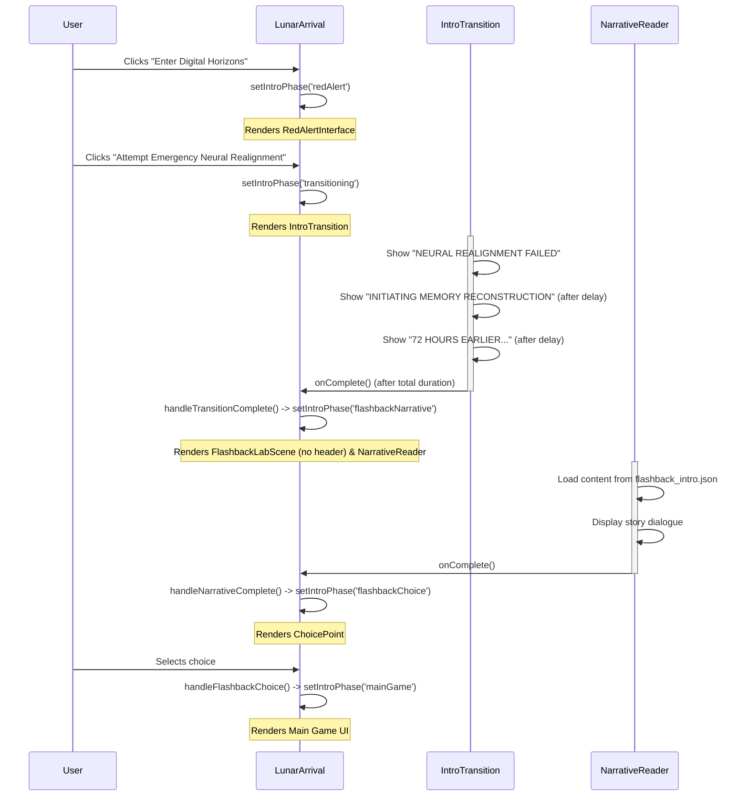

# Plan: Update Intro Sequence Timing

**Goal:** Modify the game's introduction sequence so that the "72 HOURS EARLIER..." message appears as the third message within the `IntroTransition` screen, before fading out to the `NarrativeReader` screen which displays the actual flashback story.

**Files to Modify:**

*   `src/components/IntroTransition/index.jsx` (Component Logic)
*   `src/components/IntroTransition/IntroTransition.module.scss` (Component Styles)
*   `src/components/FlashbackLabScene/index.jsx` (Remove duplicate text)

**New File to Create:**

*   `public/narratives/flashback_intro.json` (Placeholder Narrative)

**Steps:**

1.  **Create Placeholder Narrative File:**
    *   Create a new file: `public/narratives/flashback_intro.json`.
    *   Add minimal valid JSON structure for a narrative (e.g., an empty dialogue array) so the `NarrativeReader` can load it without errors when the `flashbackNarrative` phase begins. Example content:
        ```json
        {
          "id": "flashback_intro",
          "title": "Flashback Start",
          "audio": "placeholder_audio.mp3",
          "dialogue": [
            {
              "speaker": "System",
              "line": "[Placeholder for the first part of the flashback narrative...]"
            }
          ]
        }
        ```
2.  **Modify `IntroTransition` Component (`index.jsx`):**
    *   Add a third `<p>` element containing the text: `72 HOURS EARLIER - FIRST NEURAL INTEGRATION EXPERIMENT`.
    *   Import `useState` and `useEffect` from React.
    *   Use state variables to track the visibility of each message (e.g., `showMsg1`, `showMsg2`, `showMsg3`).
    *   Use `useEffect` and `setTimeout` calls to set these state variables to `true` sequentially after appropriate delays (e.g., message 2 appears 2 seconds after message 1, message 3 appears 2 seconds after message 2).
    *   Adjust the `TRANSITION_DURATION` constant to be long enough to display all three messages before the final `setTimeout` calls the `onComplete` prop.
3.  **Modify `IntroTransition` Styles (`module.scss`):**
    *   Target the third message using `:nth-child(3)`.
    *   Apply the existing `fadeInOut` animation (or a similar one).
    *   Set an appropriate `animation-delay` for the third message so it starts after the second message has appeared (e.g., `4s` if the second message delay is `2s` and each fade takes `2s`).
4.  **Modify `FlashbackLabScene` Component (`index.jsx`):**
    *   Locate the `<h2>` element containing the text "72 HOURS EARLIER - FIRST NEURAL INTEGRATION EXPERIMENT".
    *   Remove this `<h2>` element and its parent `<div>` (with class `styles.header`).

**Expected Flow Diagram:**



**Implementation:** Switch to Code mode to apply the change to the `FlashbackLabScene` component.