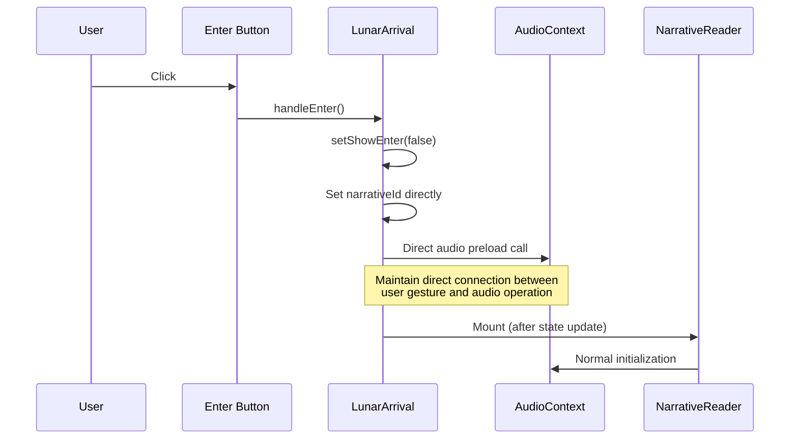
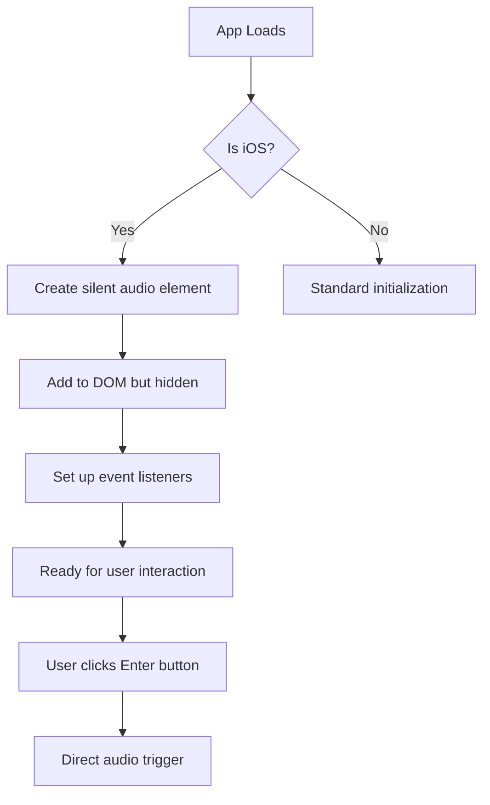
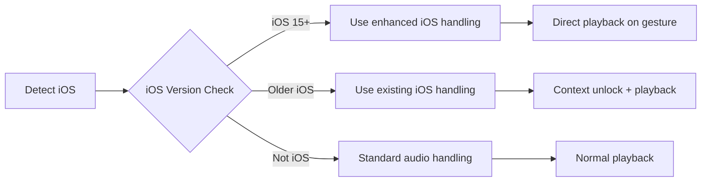
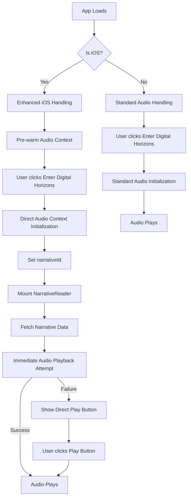

# iOS Audio Trigger Fix Plan

## Problem

On iOS devices (specifically iPhone 14 with iOS 18.3.2), clicking the "Enter Digital Horizons" trigger button doesn't start audio playback. The audio only starts playing when the pause button is clicked. A previous fix was implemented based on the fix-ios-audio-delay-plan.md, but it didn't fully resolve the issue.

## Root Cause Analysis

The core issue appears to be that iOS requires a direct user gesture to not only unlock the audio context but also to initiate actual audio playback. The current implementation has these key components:

1. The "Enter Digital Horizons" button in LunarArrival.jsx triggers state changes that mount the NarrativeReader
2. The NarrativeReader component fetches narrative data and calls playAudioFile
3. In AudioContext.jsx, there are special iOS-specific audio handling mechanisms
4. The previous fix attempted to handle pending playback after audio context initialization, but it's not working completely

Based on the behavior (audio starting only when the pause button is clicked), there are three possible root causes:

1. **Timing Issue**: The audio context might be initialized, but the actual audio element creation and playback attempt happens before iOS is fully ready
2. **Gesture Chain Break**: iOS might be losing the connection between the initial user gesture and the eventual audio playback due to asynchronous operations
3. **Incomplete Implementation**: The previous fix might not be correctly implemented in all necessary places

## Solution Approach

We propose a multi-faceted approach to ensure audio playback works correctly on iOS:

### 1. Direct Audio Trigger from User Gesture

Modify the "Enter Digital Horizons" button click handler to directly trigger audio playback, maintaining a clear chain from user gesture to audio start:



### 2. Pre-warm Audio Context

Add a pre-warming step for iOS devices that ensures the audio context is fully initialized before attempting playback:



### 3. Enhanced iOS Detection and Handling

Improve the iOS detection and special handling code to account for newer iOS versions:



## Detailed Implementation Plan

### Step 1: Enhance iOS Detection

Update the iOS detection code in AudioContext.jsx to be more comprehensive:

```javascript
// Current detection
const iOSDetected = /iPad|iPhone|iPod/.test(navigator.userAgent) && !window.MSStream

// Enhanced detection
const iOSDetected = /iPad|iPhone|iPod/.test(navigator.userAgent) && !window.MSStream
const iOSVersion = iOSDetected ? 
  parseInt((navigator.userAgent.match(/OS (\d+)_/i) || [0, '0'])[1], 10) : 0
const isNewerIOS = iOSVersion >= 15 // iOS 15 or newer
```

### Step 2: Modify the Enter Button Handler

Update the handleEnter function in LunarArrival/index.jsx to directly trigger audio context initialization and prepare for playback:

```javascript
const handleEnter = () => {
  setShowEnter(false)
  
  // For iOS, directly trigger audio context initialization
  if (isIOS) {
    // Get the narrative audio path
    const narrativeAudioPath = 'audio/narration/moon_dialogue.mp3' // Or fetch from config
    
    // Pre-load the audio file but don't play yet
    preloadAudioFile(narrativeAudioPath)
    
    // Set a flag to play as soon as possible
    setImmediatePlaybackNeeded(true)
  }
}
```

### Step 3: Add a New Preload Function to AudioContext

Add a new function in AudioContext.jsx specifically for iOS preloading:

```javascript
const preloadAudioFile = useCallback((filePath) => {
  if (!filePath) return
  
  initAudioContext() // Ensure context is initialized
  
  // For iOS, create a special preload mechanism
  if (isIOS) {
    // Create a temporary audio element for preloading
    const preloadElement = document.createElement('audio')
    preloadElement.src = `/${filePath}`
    preloadElement.load() // Load but don't play
    
    // Set up a one-time touch listener on the document that will play audio
    const playOnTouch = () => {
      playAudioFileRef.current(filePath)
      document.removeEventListener('touchstart', playOnTouch)
    }
    document.addEventListener('touchstart', playOnTouch, { once: true })
  }
}, [isIOS])
```

### Step 4: Modify the NarrativeReader Component

Update the NarrativeReader component to handle the case where audio should start immediately:

```javascript
// In NarrativeReader.jsx
useEffect(() => {
  // If we have narrative data and immediatePlaybackNeeded flag is true
  if (narrativeData && immediatePlaybackNeeded) {
    // Try to play audio immediately
    if (narrativeData.audio) {
      // Use a small timeout to ensure DOM is ready
      setTimeout(() => {
        playAudioFile(narrativeData.audio)
        setImmediatePlaybackNeeded(false)
      }, 50)
    }
  }
}, [narrativeData, immediatePlaybackNeeded, playAudioFile])
```

### Step 5: Enhance the iOS Audio Unlock Process

Modify the iOS audio unlock process in AudioContext.jsx to be more robust:

```javascript
// In the unlockAudio function
const unlockAudio = () => {
  // Create and play multiple silent sounds to ensure unlock
  const silentAudio = document.getElementById('ios-audio-unlock')
  if (silentAudio) {
    console.log('[iOS Audio Unlock] Playing silent audio to unlock iOS audio')
    
    // Play multiple times with different methods
    Promise.all([
      // Method 1: Play the silent audio
      silentAudio.play().catch(err => console.warn('Silent audio play method failed:', err)),
      
      // Method 2: Use an oscillator
      new Promise(resolve => {
        try {
          const oscillator = audioContextRef.current.createOscillator()
          oscillator.frequency.value = 1
          oscillator.connect(audioContextRef.current.destination)
          oscillator.start(0)
          oscillator.stop(0.001)
          resolve()
        } catch (e) {
          console.warn('Oscillator method failed:', e)
          resolve()
        }
      }),
      
      // Method 3: Use a buffer source
      new Promise(resolve => {
        try {
          const buffer = audioContextRef.current.createBuffer(1, 1, 22050)
          const source = audioContextRef.current.createBufferSource()
          source.buffer = buffer
          source.connect(audioContextRef.current.destination)
          source.start(0)
          resolve()
        } catch (e) {
          console.warn('Buffer source method failed:', e)
          resolve()
        }
      })
    ])
    .then(() => {
      console.log('[iOS Audio Unlock] Multiple unlock methods attempted')
      setAudioInitialized(true)
      setIOSAudioUnlocked(true)
      
      // Check for pending playback immediately
      if (pendingPlayback) {
        console.log('[iOS Audio Unlock] Processing pending playback immediately')
        handleContextStateChangeRef.current(audioContextRef.current, pendingPlayback)
      }
    })
    .catch(err => {
      console.error('[iOS Audio Unlock] All unlock methods failed:', err)
    })
  }
}
```

### Step 6: Add Direct Play Button to Initial Screen (Fallback)

As a fallback measure, add a direct "Play Audio" button to the initial screen that appears after clicking "Enter Digital Horizons":

```jsx
{!showEnter && !isPlaying && (
  <button 
    className={styles.directPlayButton} 
    onClick={() => {
      // Direct play attempt
      if (activeNarrativeId) {
        const audioPath = `audio/narration/${activeNarrativeId}.mp3`
        playAudioFile(audioPath)
      }
    }}
  >
    Start Audio
  </button>
)}
```

## Testing Plan

1. Test on multiple iOS devices with different iOS versions
2. Test with different interaction patterns:
   - Click "Enter Digital Horizons" and wait
   - Click "Enter Digital Horizons" and immediately tap elsewhere
   - Click "Enter Digital Horizons" and then click pause button
3. Monitor console logs for any errors or warnings
4. Verify audio playback starts correctly in all scenarios

## Diagram of Complete Solution



This comprehensive plan addresses the iOS audio playback issue by:
1. Maintaining a direct connection between user gestures and audio operations
2. Using multiple audio unlocking techniques for iOS
3. Providing fallback mechanisms if automatic playback fails
4. Enhancing iOS detection and version-specific handling