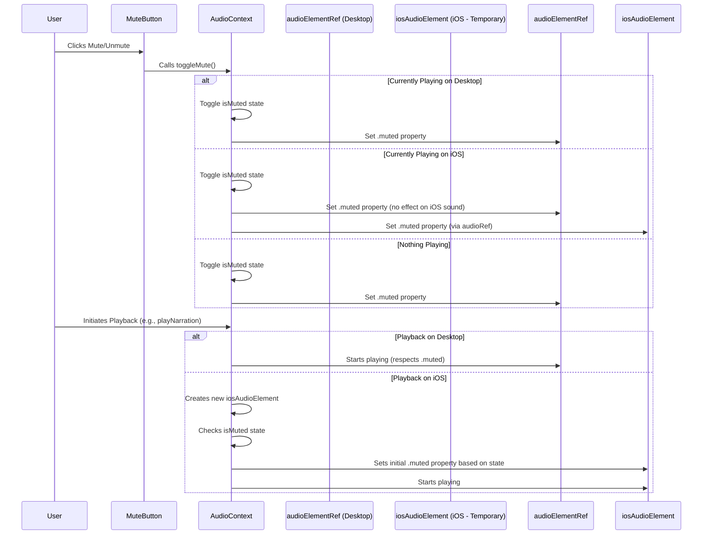

# iOS Mute Button Fix Plan

## Problem

The mute button works on desktop but not on iOS. This is because the `AudioContext` uses different audio playback mechanisms for each platform:
*   **Desktop:** Uses a persistent HTML5 `<audio>` element (`audioElementRef`).
*   **iOS:** Uses temporary HTML5 `<audio>` elements (`iosAudioElement`) created for each playback instance.
*   **Current Mute Logic:** Only targets the persistent `audioElementRef`, thus failing to mute the temporary elements used on iOS.

## Solution

Modify `src/contexts/AudioContext.jsx` as follows:

1.  **Update `toggleMute` Function:**
    *   Continue updating the `isMuted` state.
    *   Continue setting the `.muted` property on `audioElementRef.current`.
    *   **Add:** Check if `audioRef.current` (which points to the currently active audio element, potentially the temporary iOS one) exists and set its `.muted` property according to the new `isMuted` state.

2.  **Update `playAudioWithTone` Function (iOS Playback):**
    *   **Add:** When creating a new temporary `iosAudioElement`, check the current `isMuted` state *before* playback starts.
    *   Set the initial `.muted` property of the new `iosAudioElement` to match the current `isMuted` state.

## Diagram

## Summary

This plan ensures the mute button controls the correct audio element on both desktop and iOS, and that new audio playback on iOS respects the current mute state.