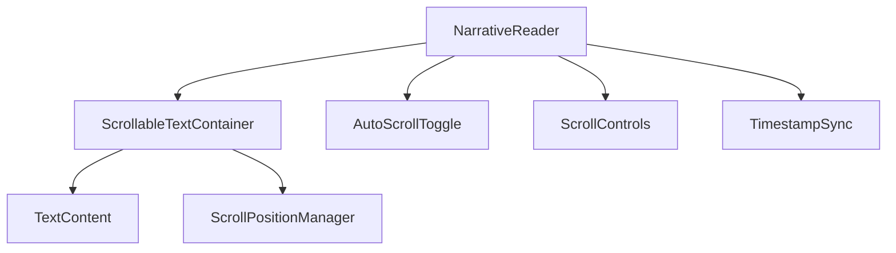

# Narrative Scroll Implementation Plan

## Overview
Replace current paginated narrative display with a scrollable text container that:
- Shows all text at once in a scrollable view
- Auto-scrolls in sync with audio timestamps
- Allows manual scrolling when auto-scroll is disabled

## Component Architecture

## Implementation Details

### 1. Scrollable Text Container
- Combine all narrative text into single continuous block
- Set fixed height (e.g. 60vh) with overflow-y: scroll
- Calculate scroll positions for each timestamp
- Implement smooth scrolling animation

### 2. Auto-Scroll Functionality
- Track current audio timestamp
- Map timestamps to scroll positions
- Animate scroll position changes
- Pause auto-scroll when user manually scrolls

### 3. Manual Controls
- Add up/down scroll buttons
- Implement manual scroll with arrow keys
- Visual indicator of current position
- Toggle between auto/manual modes

### 4. UI Changes Required
- Add auto-scroll toggle checkbox
- Replace pagination arrows with scroll controls
- Style scrollbar for better UX
- Position indicator showing progress

## Technical Considerations
- Use React refs to manage scroll position
- Implement scroll position calculations based on text height
- Add debounce to scroll events
- Optimize performance for long narratives

## Timeline
1. Modify component structure (1 hour)
2. Implement scroll logic (2 hours)
3. Add UI controls (1 hour)
4. Testing and refinement (1 hour)