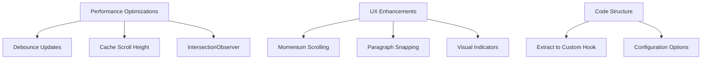

# Narrative Scroll Implementation Plan

## Current Implementation Analysis
- Uses custom `useAutoScroll` hook with basic debouncing
- Tracks scroll position relative to audio progress
- Includes basic UX features (scroll indicators, paragraph snapping)
- Partial performance optimizations (debouncing, height caching)

## Improvement Roadmap



### Phase 1: Performance Optimizations (High Priority)
1. **Enhanced Debouncing**
   - Throttle scroll position updates to 100ms intervals
   - Cache calculations between frames
   - Use requestAnimationFrame for smooth updates

2. **Scroll Height Caching**
   - Implement ResizeObserver for dynamic content changes
   - Cache calculated heights in refs
   - Recalculate only when content changes

3. **IntersectionObserver Optimization**
   - Track visible paragraphs efficiently
   - Implement lazy disconnect/reconnect
   - Adjust thresholds for better accuracy

### Phase 2: UX Enhancements (Medium Priority)
1. **Momentum Scrolling**
   - Physics-based easing
   - Velocity tracking
   - Natural deceleration

2. **Paragraph Snapping**
   - Threshold detection (50px)
   - Smooth alignment
   - Visual feedback

3. **Visual Indicators**
   - Auto-scroll state
   - Current position
   - Scroll direction

### Phase 3: Code Structure (High Priority)
1. **Custom Hook Refactor**
```javascript
const {
  scrollRef,
  isScrolling,
  progress,
  enableAutoScroll,
  disableAutoScroll
} = useAutoScroll({
  duration,
  debounceInterval: 100,
  snapThreshold: 50,
  momentum: true
});
```

2. **Configuration Options**
   - Scroll speed
   - Easing functions
   - Threshold values
   - Performance tuning

## Implementation Timeline
1. Week 1: Performance optimizations
2. Week 2: UX enhancements
3. Week 3: Code refactoring
4. Week 4: Testing and polish

## Testing Considerations
- Different content lengths
- Various screen sizes
- Performance metrics
- Accessibility validation