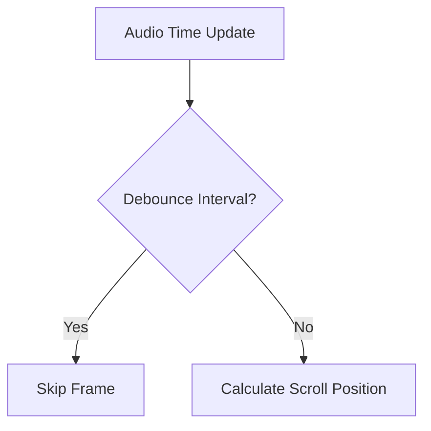

# Narrative Scroll Implementation Plan

## Current Implementation Analysis
- Linear scroll mapping based on audio progress
- Uses requestAnimationFrame for smooth updates
- Lacks performance optimizations
- Minimal user control/interruption handling

## Performance Optimizations (High Priority)

### 1. Debounced Updates


### 2. Cached Measurements
- Store scrollHeight in ref after initial calculation
- Only recalculate on window resize or content change

### 3. IntersectionObserver
- Track visible paragraphs for efficient rendering
- Implement lazy loading for long narratives

## UX Enhancements (Medium Priority)

### 1. Momentum Scrolling
- Physics-based easing when manually interrupted
- Smooth acceleration/deceleration curves

### 2. Paragraph Snapping
```javascript
function snapToParagraph(scrollTop) {
  const paragraphs = Array.from(container.querySelectorAll('.pageContent'));
  const targets = paragraphs.map(p => p.getBoundingClientRect().top);
  // Find nearest paragraph boundary
}
```

### 3. Visual Indicators
- Auto-scroll active state (CSS animation)
- Current position indicator
- Scroll progress bar

## Code Structure Improvements

### 1. Custom Hook (`useAutoScroll`)
```javascript
export function useAutoScroll({
  duration,
  debounceInterval = 100,
  snapThreshold = 50
}) {
  // Implementation...
}
```

### 2. Configuration Options
- Scroll speed adjustment
- Easing function selection
- Snap sensitivity

## Implementation Phases

1. **Phase 1**: Performance Foundations
   - Extract to custom hook
   - Add debouncing and caching
   - Basic interruption handling

2. **Phase 2**: UX Polish
   - Momentum scrolling
   - Paragraph snapping
   - Visual indicators

3. **Phase 3**: Advanced Features
   - Accessibility enhancements
   - Reduced motion support
   - Keyboard controls

## Testing Strategy
1. Unit tests for scroll calculations
2. Performance profiling
3. Cross-browser testing
4. Long narrative stress testing