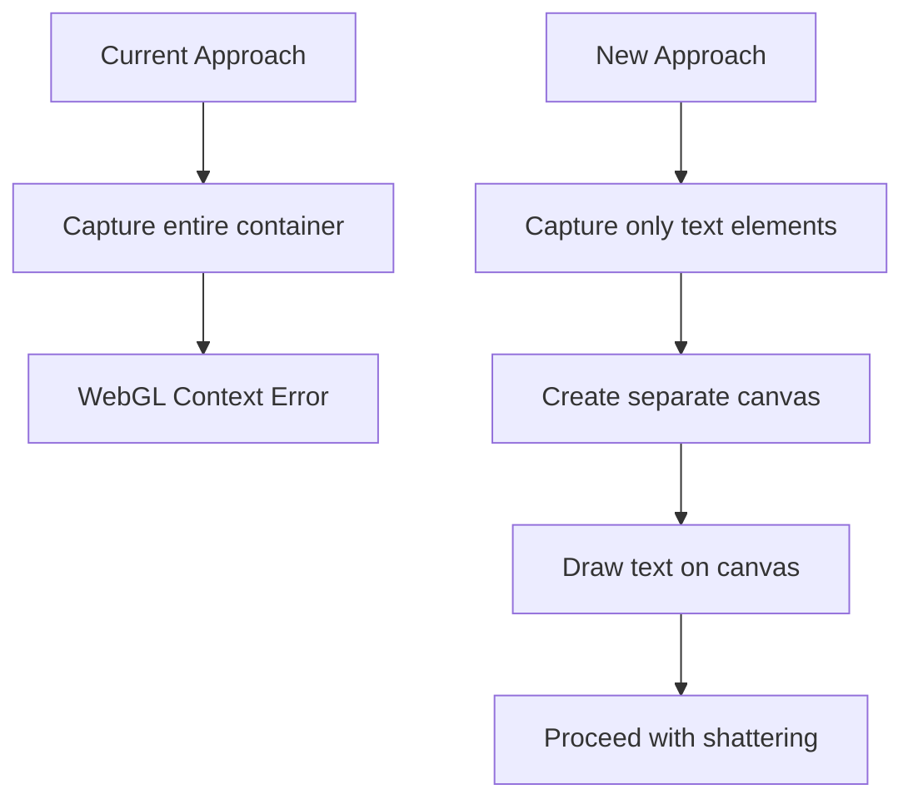
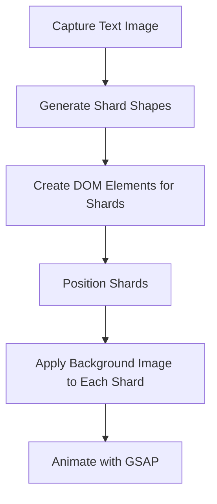
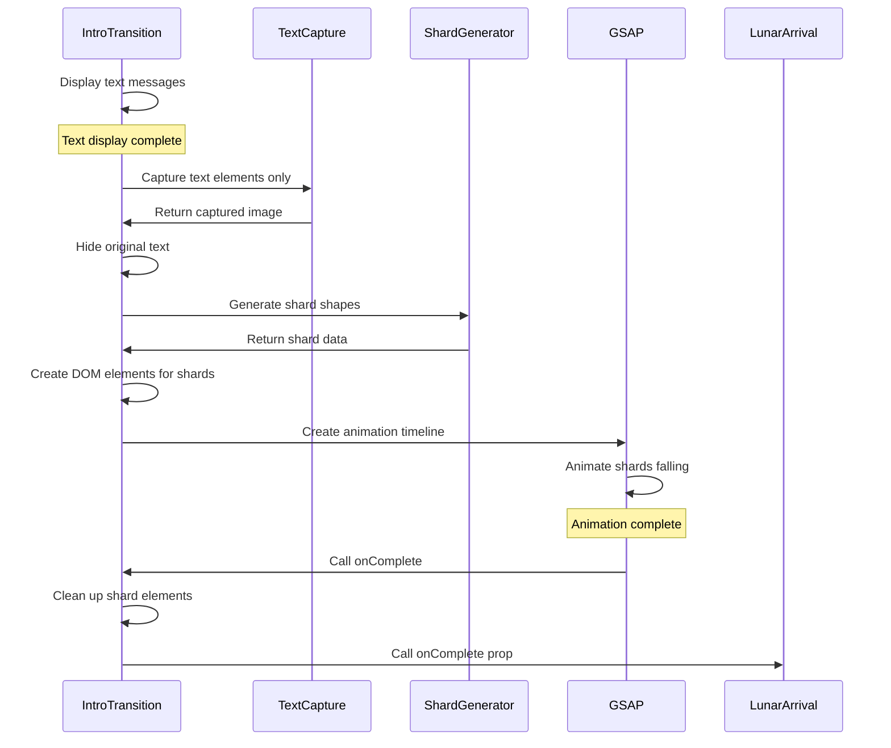

# Detailed Plan: Fixing Shatter Transition Effect Issues

## Current Issues

1. **WebGL Context Error**: `html2canvas` cannot capture the Three.js canvas because it has `preserveDrawingBuffer=false`.
2. **GSAP Animation Error**: The GSAP animation fails because the target (`dummyShards`) is empty/undefined.

## Solution Plan

### 1. Fix WebGL Context Issue

Instead of capturing the entire container (which includes the Three.js canvas), we'll modify our approach to only capture the text elements:



**Implementation Steps:**

1. **Modify Component Structure**:
   - Create a separate div specifically for the text content
   - Position this div in the same location as the current text
   - Style it with the same background color as the container

2. **Update Capture Logic**:
   ```jsx
   // Instead of capturing containerRef
   html2canvas(textElementsRef.current, {
     backgroundColor: '#000', // Match the background color
     useCORS: true
   })
   ```

3. **Handle Background**:
   - Ensure the canvas used for shattering has the same background color
   - This maintains visual consistency during the transition

### 2. Implement Shard Generation and Animation

We'll create a proper implementation for generating glass-like shards and animating them:



**Implementation Steps:**

1. **Generate Shard Shapes**:
   ```javascript
   // Function to generate random points for Voronoi-like shattering
   function generateShardPoints(width, height, numPoints = 20) {
     const points = [];
     // Create some points along the edges to ensure coverage
     // Top and bottom edges
     for (let i = 0; i < width; i += width / 5) {
       points.push([i, 0]);
       points.push([i, height]);
     }
     // Left and right edges
     for (let i = 0; i < height; i += height / 5) {
       points.push([0, i]);
       points.push([width, i]);
     }
     
     // Add random internal points
     for (let i = 0; i < numPoints; i++) {
       points.push([
         Math.random() * width,
         Math.random() * height
       ]);
     }
     return points;
   }
   
   // Function to generate triangles from points (simplified Delaunay triangulation)
   function generateShards(points, width, height) {
     // This would use a triangulation algorithm
     // For simplicity, we'll use a placeholder approach
     const shards = [];
     
     // Create triangles by connecting nearby points
     // This is a simplified approach - a real implementation would use Delaunay triangulation
     for (let i = 0; i < points.length - 2; i++) {
       shards.push({
         vertices: [points[i], points[i+1], points[i+2]],
         center: [
           (points[i][0] + points[i+1][0] + points[i+2][0]) / 3,
           (points[i][1] + points[i+1][1] + points[i+2][1]) / 3
         ]
       });
     }
     
     return shards;
   }
   ```

2. **Create DOM Elements for Shards**:
   ```javascript
   // After generating shards
   const shardElements = [];
   
   shards.forEach((shard, index) => {
     // Create a div for each shard
     const shardEl = document.createElement('div');
     shardEl.className = styles.shard;
     
     // Create clip path from vertices
     const clipPath = `polygon(${
       shard.vertices.map(v => `${v[0]}px ${v[1]}px`).join(', ')
     })`;
     
     // Position and style the shard
     shardEl.style.position = 'absolute';
     shardEl.style.left = '0';
     shardEl.style.top = '0';
     shardEl.style.width = `${width}px`;
     shardEl.style.height = `${height}px`;
     shardEl.style.backgroundImage = `url(${capturedImageUrl})`;
     shardEl.style.clipPath = clipPath;
     shardEl.style.webkitClipPath = clipPath;
     
     // Add to container and store reference
     canvasRef.current.parentNode.appendChild(shardEl);
     shardElements.push(shardEl);
   });
   ```

3. **Animate with GSAP**:
   ```javascript
   // Create GSAP timeline for animation
   const tl = gsap.timeline({
     onComplete: () => {
       // Clean up shard elements
       shardElements.forEach(el => el.remove());
       setAnimationPhase('done');
       if (onComplete) onComplete();
     }
   });
   
   // Add animations for each shard
   shardElements.forEach((el, index) => {
     const shard = shards[index];
     const delay = index * 0.01; // Stagger the animations
     
     tl.to(el, {
       y: `+=${100 + Math.random() * 400}`, // Fall down
       x: `${(shard.center[0] < width/2) ? '-' : '+'}=${20 + Math.random() * 80}`, // Move away from center
       rotation: Math.random() * 90 - 45, // Random rotation
       opacity: 0,
       duration: 1.5,
       ease: "power1.in",
       delay: delay
     }, 0); // Start at the same time with different delays
   });
   ```

### 3. Add CSS for Shards

Add the necessary styles to `IntroTransition.module.scss`:

```scss
.shard {
  position: absolute;
  top: 0;
  left: 0;
  background-repeat: no-repeat;
  background-position: center center;
  background-size: cover;
  transform-origin: center;
  box-shadow: 0 0 10px rgba(255, 0, 0, 0.3); /* Red glow for glass effect */
}
```

### 4. Optimize Performance

To ensure smooth animation:

1. **Limit Number of Shards**:
   - Start with a reasonable number (20-30) and adjust based on performance
   - Use fewer, larger shards on mobile devices

2. **Use `will-change` CSS Property**:
   ```scss
   .shard {
     will-change: transform, opacity;
     /* other styles */
   }
   ```

3. **Batch DOM Operations**:
   - Create all shard elements before appending to DOM
   - Use document fragment for better performance

## Flow Diagram



## Implementation Considerations

1. **Fallback Mechanism**:
   - If capture or shard generation fails, gracefully transition to the next phase
   - Add error handling to prevent the app from getting stuck

2. **Performance Testing**:
   - Test on lower-end devices to ensure animation remains smooth
   - Be prepared to reduce shard count or animation complexity if needed

3. **Visual Refinement**:
   - Add subtle effects like rotation during fall
   - Consider adding small random delays to make the shattering look more natural
   - Experiment with different easing functions for realistic physics