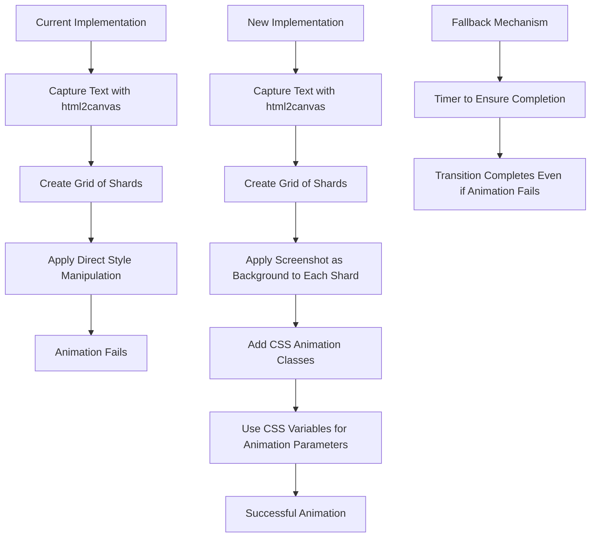
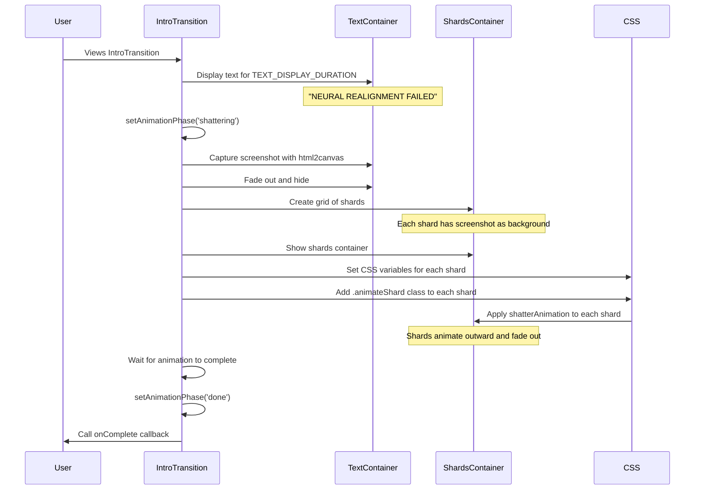

# Plan: Fix Shatter Transition Effect with CSS Animations and Glass-like Fragments

Based on our analysis and your preferences, I'll create a detailed plan to fix the shatter transition effect using CSS animations and making the shards look like glass fragments of the original text.

## Problem Analysis

The current implementation has several issues:

1. The animation of the shards is not working correctly, despite using direct style manipulation
2. The current approach tries to use inline style transitions rather than CSS animations
3. The shards are visible with proper colors but don't look like glass fragments of the text
4. The html2canvas screenshot is captured but not properly utilized for the shards

## Solution Overview



## Detailed Implementation Plan

### 1. Update CSS Animation Definitions

First, we'll enhance the CSS animations in `IntroTransition.module.scss`:

```scss
// Shard element for glass pieces
.shard {
  position: absolute;
  transform-origin: center;
  box-shadow: 0 0 15px rgba(255, 0, 0, 0.7), inset 0 0 8px rgba(255, 0, 0, 0.5);
  will-change: transform, opacity;
  backface-visibility: hidden;
  filter: brightness(1.2);
  z-index: 2000;
  background-size: cover; // Ensure background image covers the shard
  background-repeat: no-repeat;
  border: 1px solid rgba(255, 255, 255, 0.7); // Subtle white border for glass edge effect
}

// Animation class for shards
.animateShard {
  animation: shatterAnimation var(--duration, 2s) forwards var(--easing, ease-in-out);
  animation-delay: var(--delay, 0s);
}

// Keyframes for shard animation
@keyframes shatterAnimation {
  0% {
    transform: translate(0, 0) rotate(0deg) scale(1);
    opacity: 1;
  }
  100% {
    transform: translate(var(--x-move, 0px), var(--y-move, 100px)) rotate(var(--rotation, 0deg)) scale(var(--scale, 0.8));
    opacity: 0;
  }
}
```

### 2. Modify the Screenshot Capture Process

We'll ensure the screenshot capture process works correctly:

```javascript
// Capture screenshot of text container
const captureScreenshot = () => {
  if (!textContainerRef.current) {
    console.error('[IntroTransition] Cannot capture screenshot, text container ref not available');
    return Promise.reject('Text container ref not available');
  }
  
  console.log('[IntroTransition] Capturing screenshot of text');
  
  return html2canvas(textContainerRef.current, {
    backgroundColor: 'rgba(0, 0, 0, 0.9)',
    logging: false,
    scale: window.devicePixelRatio || 1,
  }).then(canvas => {
    console.log('[IntroTransition] Screenshot captured successfully');
    return canvas.toDataURL('image/png');
  }).catch(err => {
    console.error('[IntroTransition] Screenshot capture failed:', err);
    return null;
  });
};
```

### 3. Update Shard Creation to Use the Screenshot

We'll modify the shard creation function to use the screenshot as the background:

```javascript
// Create a grid of shards with React state approach
const createShards = (screenshotUrl) => {
  console.log('[IntroTransition] Creating shards grid with screenshot');
  
  if (!containerRef.current) {
    console.error('[IntroTransition] Container ref is null');
    return [];
  }
  
  const container = containerRef.current;
  const width = container.clientWidth;
  const height = container.clientHeight;
  const cellWidth = width / GRID_SIZE;
  const cellHeight = height / GRID_SIZE;
  
  setContainerDimensions({ width, height });
  console.log(`[IntroTransition] Container dimensions: ${width}x${height}`);
  console.log(`[IntroTransition] Cell dimensions: ${cellWidth}x${cellHeight}`);
  
  const newShards = [];
  
  // Create grid of shards
  for (let x = 0; x < GRID_SIZE; x++) {
    for (let y = 0; y < GRID_SIZE; y++) {
      // Calculate position from center for delay
      const centerX = GRID_SIZE / 2;
      const centerY = GRID_SIZE / 2;
      const distanceFromCenter = Math.sqrt(
        Math.pow(x - centerX, 2) +
        Math.pow(y - centerY, 2)
      );
      
      // Calculate direction based on position
      const xDirection = x < GRID_SIZE / 2 ? -1 : 1;
      const yDirection = y < GRID_SIZE / 2 ? -1 : 1;
      
      newShards.push({
        id: `shard-${x}-${y}`,
        x,
        y,
        width: cellWidth,
        height: cellHeight,
        left: x * cellWidth,
        top: y * cellHeight,
        distanceFromCenter,
        xDirection,
        yDirection,
        // Calculate background position to show the correct part of the screenshot
        backgroundPosition: `-${x * cellWidth}px -${y * cellHeight}px`,
        backgroundImage: screenshotUrl ? `url(${screenshotUrl})` : 'none'
      });
    }
  }
  
  console.log(`[IntroTransition] Created ${newShards.length} shards`);
  setVisibleShardCount(newShards.length);
  setShards(newShards);
  return newShards;
};
```

### 4. Update Animation Logic to Use CSS Classes

Instead of direct style manipulation, we'll use CSS classes and CSS variables:

```javascript
// Animate the shards with CSS animations
const animateShards = () => {
  console.log('[IntroTransition] Animating shards with CSS animations');
  
  if (shards.length === 0) {
    console.error('[IntroTransition] No shards to animate');
    return;
  }
  
  console.log(`[IntroTransition] Starting animation of ${shards.length} shards`);
  
  // Set a fallback timer to ensure we don't get stuck
  const fallbackTimer = setTimeout(() => {
    console.log('[IntroTransition] Fallback timer triggered - animation may have failed');
    setFallbackTimerActive(true);
    // Complete the transition
    setAnimationPhase('done');
    if (onComplete) {
      onComplete();
    }
  }, SHATTER_ANIMATION_DURATION + 2000); // Animation duration plus buffer
  
  fallbackTimerRef.current = fallbackTimer;
  
  try {
    // Apply animations using CSS classes
    setTimeout(() => {
      console.log('[IntroTransition] Applying CSS animations to shards');
      
      const shardElements = document.querySelectorAll(`.${styles.shard}`);
      console.log(`[IntroTransition] Found ${shardElements.length} shard elements in DOM`);
      
      if (shardElements.length > 0) {
        shardElements.forEach((el, index) => {
          if (index < shards.length) {
            const shard = shards[index];
            
            // Calculate animation parameters
            const xMove = (shard.xDirection > 0 ? 1 : -1) * (30 + Math.random() * 70);
            const yMove = (shard.yDirection > 0 ? 1 : -1) * (100 + Math.random() * 200);
            const rotation = Math.random() * 360 - 180;
            const scale = 0.8 + Math.random() * 0.4;
            const delay = shard.distanceFromCenter * 0.1;
            
            // Set CSS variables for the animation
            el.style.setProperty('--x-move', `${xMove}px`);
            el.style.setProperty('--y-move', `${yMove}px`);
            el.style.setProperty('--rotation', `${rotation}deg`);
            el.style.setProperty('--scale', scale);
            el.style.setProperty('--delay', `${delay}s`);
            el.style.setProperty('--duration', `${SHATTER_ANIMATION_DURATION/1000}s`);
            el.style.setProperty('--easing', 'cubic-bezier(0.5, 0, 0.75, 0.5)');
            
            // Force a reflow before adding the animation class
            void el.offsetWidth;
            
            // Add the animation class
            el.classList.add(styles.animateShard);
            
            console.log(`[IntroTransition] Applied CSS animation to shard ${index}`);
          }
        });
        
        console.log('[IntroTransition] All shard animations applied');
      } else {
        console.error('[IntroTransition] No shard elements found in DOM');
      }
    }, 100);
    
    // Set a timer to complete the animation
    setTimeout(() => {
      console.log('[IntroTransition] Animation timer complete');
      
      // Clear the fallback timer
      if (fallbackTimerRef.current) {
        clearTimeout(fallbackTimerRef.current);
        fallbackTimerRef.current = null;
        setFallbackTimerActive(false);
      }
      
      // Complete the transition after a delay
      setTimeout(() => {
        console.log('[IntroTransition] Transition complete, moving to done phase');
        setAnimationPhase('done');
        if (onComplete) {
          console.log('[IntroTransition] Calling onComplete callback');
          onComplete();
        }
      }, 1000); // Wait 1 second before completing
    }, SHATTER_ANIMATION_DURATION + 500); // Animation duration plus buffer
  } catch (err) {
    console.error('[IntroTransition] Error in animation:', err);
    
    // Fallback if animation fails
    setTimeout(() => {
      setAnimationPhase('done');
      if (onComplete) {
        onComplete();
      }
    }, 2000);
  }
};
```

### 5. Update the Shattering Phase Logic

We'll modify the shattering phase effect to properly capture the screenshot and create shards:

```javascript
// Handle shattering phase with improved visibility control
useEffect(() => {
  if (animationPhase === 'shattering') {
    console.log('[IntroTransition] Starting shatter animation with delay');
    
    // Add a delay before starting the animation for better visibility
    setTimeout(() => {
      try {
        // Capture screenshot of text container
        captureScreenshot().then(screenshotUrl => {
          // Fade out text container with transition
          if (textContainerRef.current) {
            console.log('[IntroTransition] Fading out text container');
            textContainerRef.current.style.transition = 'opacity 0.3s ease-out';
            textContainerRef.current.style.opacity = '0';
            
            // After fade out, hide completely
            setTimeout(() => {
              if (textContainerRef.current) {
                textContainerRef.current.style.visibility = 'hidden';
              }
              
              // Show shards container
              if (shardsContainerRef.current) {
                console.log('[IntroTransition] Showing shards container');
                shardsContainerRef.current.style.visibility = 'visible';
                shardsContainerRef.current.style.opacity = '1';
                
                // Create shards with the screenshot URL
                createShards(screenshotUrl);
                
                // Start animation
                console.log('[IntroTransition] Starting animation');
                setTimeout(() => {
                  animateShards();
                }, 100);
              }
            }, 300);
          }
        }).catch(err => {
          console.error('[IntroTransition] Error in screenshot capture:', err);
          // Continue with animation even if screenshot fails
          if (shardsContainerRef.current) {
            shardsContainerRef.current.style.visibility = 'visible';
            createShards(null); // Create shards without screenshot
            animateShards();
          }
        });
      } catch (err) {
        console.error('[IntroTransition] Shatter animation error:', err);
        
        // Fallback if animation fails
        setAnimationPhase('done');
        if (onComplete) {
          onComplete();
        }
      }
    }, TRANSITION_DELAY);
  }
}, [animationPhase, onComplete]);
```

### 6. Update the Shard Rendering in JSX

We'll update the shard rendering in the JSX to use the background image:

```jsx
{/* Shards container */}
<div
  ref={shardsContainerRef}
  style={{
    position: 'absolute',
    top: 0,
    left: 0,
    width: '100%',
    height: '100%',
    visibility: 'hidden',
    opacity: 1,
    zIndex: 2000,
    backgroundColor: 'rgba(0, 0, 0, 0.5)',
    border: '3px dashed white',
    transition: 'opacity 0.3s ease-in'
  }}
>
  {/* Shards will be rendered here */}
  {animationPhase === 'shattering' && shards.map((shard, index) => (
    <div
      key={shard.id}
      className={styles.shard}
      style={{
        position: 'absolute',
        left: `${shard.left}px`,
        top: `${shard.top}px`,
        width: `${shard.width}px`,
        height: `${shard.height}px`,
        backgroundImage: shard.backgroundImage,
        backgroundPosition: shard.backgroundPosition,
        backgroundSize: `${containerDimensions.width}px ${containerDimensions.height}px`
      }}
    />
  ))}
</div>
```

## Implementation Sequence



## Fallback Mechanisms

To ensure the transition completes even if the animation fails:

1. **Fallback Timer**: A timer that triggers after the expected animation duration plus a buffer, ensuring the transition completes.

2. **Error Handling**: Catch blocks around critical operations to handle errors gracefully.

3. **Animation Completion Detection**: A timer that triggers after the expected animation duration to detect when the animation should be complete.

4. **Screenshot Fallback**: If the screenshot capture fails, continue with colored shards instead.

## Testing Plan

1. **Visual Testing**: Verify that the shards appear and animate correctly.

2. **Console Logging**: Check the console logs to ensure each step is executing correctly.

3. **Fallback Testing**: Intentionally break parts of the animation to verify the fallback mechanisms work.

4. **Browser Compatibility**: Test in different browsers to ensure the CSS animations work consistently.

## Expected Result

A visually striking glass shattering transition effect where:

1. Text is clearly visible before the transition
2. The text appears to shatter into glass-like fragments
3. The fragments animate outward from their original positions
4. The animation is smooth and visually appealing
5. The transition completes reliably even if the animation fails