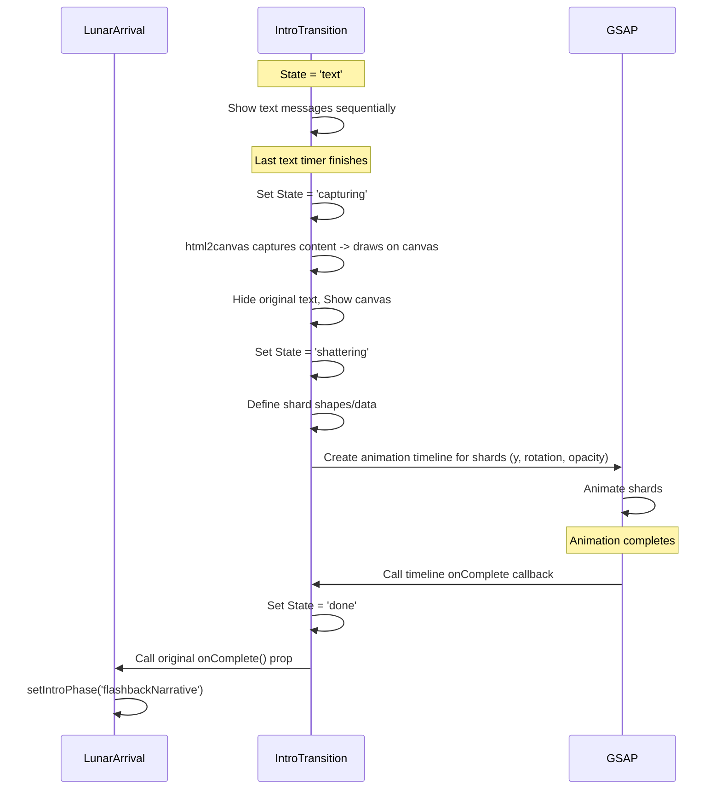

# Plan: Implement Shatter Transition Effect

**Goal:** Create a visual transition effect where the `IntroTransition` screen appears to shatter like glass, with pieces falling away to reveal the `FlashbackLabScene` underneath, before proceeding to the `flashbackNarrative` phase.

**Approach:** Use Canvas 2D for rendering the effect and GSAP for animation, implemented within the `IntroTransition` component. Utilize `html2canvas` to capture the component's appearance for shattering.

**Files to Modify:**

*   `src/components/IntroTransition/index.jsx` (Component Logic, Canvas, Animation)
*   `src/components/IntroTransition/IntroTransition.module.scss` (Canvas/Shard Styles)
*   `src/scenes/LunarArrival/index.jsx` (Ensure layering)
*   `package.json` / `package-lock.json` (If `html2canvas` needs installation)

**Steps:**

1.  **Install Dependency:**
    *   Check `package.json` for `html2canvas`.
    *   If missing, run `npm install html2canvas`.
2.  **Layering (`LunarArrival/index.jsx` & CSS):**
    *   Verify that during the `transitioning` phase, `FlashbackLabScene` is rendered *behind* `IntroTransition`.
    *   Adjust `z-index` or `position` styles if necessary to ensure correct layering.
3.  **Modify `IntroTransition` Component (`src/components/IntroTransition/index.jsx`):**
    *   **Imports:** Add imports for `useRef`, `useState`, `useEffect`, `gsap`, `html2canvas`.
    *   **Canvas Ref:** Create `canvasRef = useRef(null)`.
    *   **State:** Add `animationPhase` state (`'text'`, `'capturing'`, `'shattering'`, `'done'`).
    *   **JSX:** Add `<canvas ref={canvasRef} className={styles.transitionCanvas}></canvas>`.
    *   **Capture Logic (`useEffect` based on text completion):**
        *   Set `animationPhase` to `'capturing'`.
        *   Use `html2canvas(elementToCapture)` to get a canvas rendering of the component's content.
        *   Draw the captured canvas onto `canvasRef`.
        *   Hide original text elements.
        *   Make `canvasRef` visible.
        *   Set `animationPhase` to `'shattering'`.
    *   **Shatter Logic (`useEffect` based on `animationPhase === 'shattering'`):**
        *   Get 2D context of `canvasRef`.
        *   Implement algorithm to define shard polygons (e.g., Voronoi diagram based on random points, or simpler random triangles).
        *   Store shard data: polygon vertices, initial position, reference to the corresponding section of the captured image data (using `clip()` and `drawImage()` or storing individual shard image data).
        *   Clear the main canvas (`canvasRef`).
    *   **Animation Logic:**
        *   Create DOM elements for each shard (or manage drawing on canvas layers).
        *   Use GSAP `timeline()`:
            *   Target shard elements/data.
            *   Animate `y` property (downwards, potentially with slight random variance and ease like `Power1.easeIn`).
            *   Animate `rotation` (small random rotation).
            *   Animate `opacity` to fade out (e.g., from 1 to 0 over the last half of the animation).
            *   Set an `onComplete` callback for the timeline.
    *   **Completion (GSAP `onComplete`):**
        *   Set `animationPhase` to `'done'`.
        *   Call the `onComplete` prop received from `LunarArrival`.
4.  **Modify `IntroTransition` Styles (`src/components/IntroTransition/IntroTransition.module.scss`):**
    *   Add styles for `.transitionCanvas`: `position: absolute; top: 0; left: 0; width: 100%; height: 100%; z-index: 1; visibility: hidden;` (adjust as needed).
    *   Add base styles for shard elements if using DOM: `position: absolute; /* other base styles */`.

**Flow Diagram Snippet (Transition Focus):**

**Implementation:** Switch to Code mode to install dependencies (if needed) and implement the Canvas/GSAP logic within `IntroTransition` and adjust layering in `LunarArrival`.