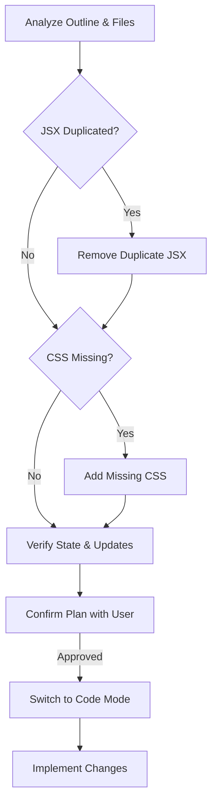

# Signal Tuning Stability Gauge Implementation Plan

This plan outlines the steps to complete the implementation of the signal stability gauge in the `SignalTuningInterface` component.

**Current Status:**

Based on the review of `src/components/SignalTuningInterface.jsx` and `src/components/SignalTuningInterface.module.scss`:
- The necessary state (`stability`, `dominantInterpretation`) is accessible.
- A horizontal bar visual representation has been chosen and partially implemented in JSX.
- The basic JSX structure for the gauge is present but duplicated.
- Basic CSS styles for the gauge elements are present.
- The conditional class for dynamic feedback (`nearing-threshold`) is applied in JSX, but the corresponding CSS styles and animation are missing.
- The component correctly triggers updates when stability changes.

**Plan:**

1.  **Clean up `SignalTuningInterface.jsx`**: Remove the duplicate block of JSX code for the stability gauge within the component's `return` statement.
2.  **Update `SignalTuningInterface.module.scss`**: Add the missing CSS rules for the numeric stability value display (`.stabilityGaugeValue`), the `.nearingThreshold` class, and the `@keyframes pulse-warning` animation as provided in the original outline.

Once these steps are completed, the signal stability gauge should be fully implemented and styled according to the provided outline.