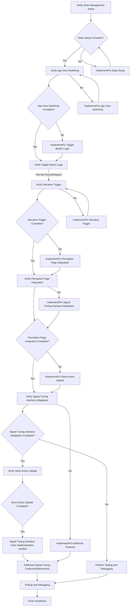

# Signal Tuning Interface Verification Plan

This document outlines the verification steps performed for the signal tuning interface implementation and a plan for remaining work.

## Verified Steps

The following steps for the signal tuning interface implementation have been verified:

1.  **Phase 1: State Management Setup in `useGameStore.js`**: Verified. The `currentView` and `activeTuningChallenge` state variables and the `setView` and `setActiveTuningChallenge` actions are present in `src/store/useGameStore.js`.
2.  **Main App Structure & View Switching in `App.jsx`**: Verified. `src/App.jsx` reads `currentView` from the store and conditionally renders `NarrativeReader` or `PerceptionPage`. The `advanceNarrativeAction` is also accessible.
3.  **Modify TogglePerceptionButton.jsx**: File not found. The view toggling functionality appears to be implemented directly in `src/App.jsx`. As requested, this step was skipped for verification.
4.  **Triggering Tuning from Narrative in `NarrativeReader.jsx`**: Verified. `src/components/NarrativeReader/index.jsx` includes logic to call `setActiveTuningChallenge` based on narrative node data.
5.  **Adapting SignalTuningInterface.jsx**: Verified. `src/components/SignalTuningInterface.jsx` accepts `challengeConfig` and `advanceNarrative` props and uses the `challengeConfig` data to set up the tuning logic and calls `advanceNarrative` upon successful tuning.
6.  **Updating advanceNarrativeAction in Store**: Verified. The `advanceNarrativeAction` in `src/store/useGameStore.js` includes logic to clear the active tuning challenge and switch the view back to 'narrative'.

## Plan for Remaining Work

Based on the steps provided and the verification performed, the core implementation for the signal tuning interface seems complete according to the outlined steps. The following plan addresses the remaining work:

**Detailed Plan:**

1.  **Confirm Verified Steps:** Review the verification results for steps 1, 2, 4, 5, and 6 to ensure they meet expectations.
2.  **Address Skipped Step:** Note that step 3 (TogglePerceptionButton.jsx) was skipped due to the file not being found and the functionality likely being in `App.jsx`. If a separate component is desired later, it can be created.
3.  **Identify Remaining Work:** Determine if there are any additional features, refinements, or integrations required for the signal tuning interface beyond the steps provided. This might include:
    *   Implementing specific visual feedback for tuning (e.g., waveform clarity, audio tones, spectrum analyzer).
    *   Refining the tuning logic within `SignalTuningInterface.jsx` based on specific challenge requirements.
    *   Integrating the signal tuning outcome with other game systems (if not already covered).
4.  **Testing:** Conduct thorough testing of the complete signal tuning flow. This includes:
    *   Triggering a tuning challenge from a narrative node.
    *   Verifying that the view switches correctly to the perception page.
    *   Interacting with the tuning controls and observing the visual and audio feedback.
    *   Ensuring that achieving a tuned state correctly triggers the narrative advancement.
    *   Verifying that the view switches back to the narrative after tuning is complete.
    *   Testing different tuning challenges (if applicable).
5.  **Refinement:** Address any bugs, performance issues, or usability problems identified during testing. Implement any additional features or refinements identified in step 3.
6.  **Final Verification:** Perform a final, comprehensive verification of the signal tuning interface to ensure it is fully functional and integrated into the game.

This plan provides a roadmap for completing and verifying the signal tuning interface.