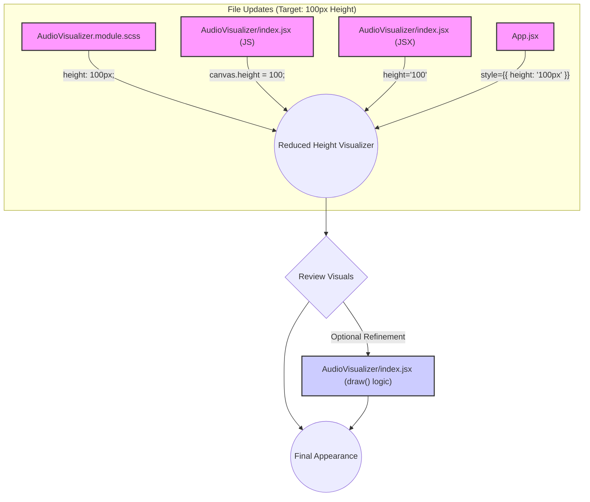

# Plan: Reduce Audio Visualizer Height

**Goal:** Make the audio visualizer less intrusive by reducing its height from 400px to 100px.

**Steps:**

1.  **Update CSS:**
    *   File: `src/components/AudioVisualizer/AudioVisualizer.module.scss`
    *   Change: Modify the `.visualizer` class rule `height: 400px;` to `height: 100px;`.

2.  **Update Component JavaScript (Resize Logic):**
    *   File: `src/components/AudioVisualizer/index.jsx`
    *   Change: In the `resizeCanvas` function, update the line `canvas.height = 400` to `canvas.height = 100`.

3.  **Update Component JSX (Default Attribute):**
    *   File: `src/components/AudioVisualizer/index.jsx`
    *   Change: Update the default `height="400"` attribute on the `<canvas>` element to `height="100"`.

4.  **Update Container in App.jsx:**
    *   File: `src/App.jsx`
    *   Change: Modify the inline style on the `div` wrapping `<AudioVisualizer />` from `style={{ height: '400px' }}` to `style={{ height: '100px' }}`.

5.  **Review & Refine:**
    *   After implementing the changes, visually inspect the visualizer.
    *   If necessary, adjust the drawing logic (bar heights, scaling factors) within the `draw()` function in `src/components/AudioVisualizer/index.jsx` to ensure the visualization looks proportional and aesthetically pleasing at the new 100px height.

**Visual Representation:**

**Next Step:** Switch to Code mode to implement these changes.